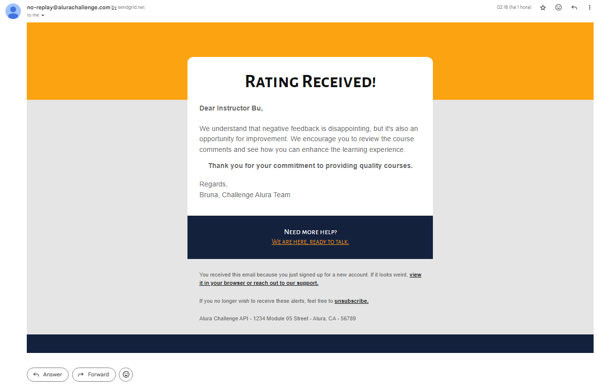

<div align="center">
  
</div>

<h1 align="center">Alura Challenge API</h1>
<p align="center">Backend Development Project: Building a Java RESTful API with Spring Boot for Educational Platform Management.</p>

<div align="center">


</div>

##

## Table of contents

* [Project Description](#project-description)
* [How to Setup?](#how-to-setup)
* [Endpoints](#endpoints)
    <details>
    <summary>Click to expand</summary>

    - [Authentication](#authentication)
        - [Register User](#register-user)
        - [Authenticate User](#authenticate-user)
    - [Users](#users)
        - [Retrieve Authenticated User](#retrieve-authenticated-user)
        - [Find User by Username](#find-user-by-username)
        - [List All Users](#list-all-users)
    - [Courses](#courses)
        - [Create a New Course](#create-a-new-course)
        - [Disable a Course](#disable-a-course)
        - [Enable a Course](#enable-a-course)
        - [List Courses](#list-courses)
    - [Enrollments](#enrollments)
        - [Enroll in Course](#enroll-in-course)
    - [Ratings](#ratings)
        - [Submit a Course Rating](#submit-a-course-rating)
    - [Application Status](#application-status)
        - [Welcome Message](#welcome-message)
        - [Check Application Health](#check-application-health)

  </details>

##

## Project Description

This project is a **Java RESTful API**, built with **Spring Boot**, aimed at managing the educational platform provided by Alura Challenge. It allows for user authentication, course management, user enrollments, and course ratings. Integrated with Swagger for API documentation, this robust platform facilitates educational management and enhances the learning experience.

##

## How to Setup?

- [x] Fork this repository to your GitHub;
- [ ] Clone your forked repository to your machine;

```bash
    git clone https://github.com/<your-username>/alura-challenge-api.git
```

#### Set up your development environment:

- [ ] Ensure [Java](https://www.oracle.com/java/technologies/javase-downloads.html)
  and [Maven](https://maven.apache.org/download.cgi) are installed on your machine.
- [ ] In your IDE's terminal, navigate to the project root directory and build the project with Maven.

```bash
    cd alura-challenge-api
    mvn clean install
```

- [ ] Run the application using Spring Boot.

```bash
   mvn spring-boot:run
```

- [ ] Explore the API endpoints at <your_port>/

```bash
    http://localhost:<your_port>/
```

- [ ] Enjoy building with the Alura Challenge API! 🚀🎉

## Endpoints

You can interact with the RESTful API using the following endpoints:

<details>
<summary>Click to expand</summary>

### Authentication
Operations related to user authentication.

#### Register User
Registers a new user to the system.
```bash
POST /auth/signup
```

E.g., to register a new user:
```json
{
  "name": "Marge Simpson",
  "username": "marge",
  "email": "bluehairwoman@simpsons.com",
  "password": "ilovemyfamily"
}
```
- Output:
```json
{
  "id": 1,
  "name": "Marge Simpson",
  "username": "marge",
  "email": "bluehairwoman@simpsons.com",
  "roles": {
    "id": 1,
    "name": "ROLE_USER"
  },
  "created_at": "2024-03-28 02:33:32",
[...]
}
```
#### Authenticate User
Authenticates a user by validating login credentials.
```bash
POST /auth/login
```
E.g., to authenticate a user:
```json
{
  "username": "marge",
  "password": "ilovemyfamily"
}
```

> [!NOTE]
> Login can be done with either username or email.


- Output:
```json
{
  "token": "dasdasdidSIsISwiZXhwIjoxNzExNjA4NzI5fQ.xWpWgqE7sSl1vwfvV-cFdBrQ2_1tZWbF5ln80nyATkE",
  "expiresIn": 3600000
}
```

### Users
Operations related to users.

#### Retrieve Authenticated User
Fetches details of the currently authenticated user. User privileges required.
```bash
GET /users/me
```

#### Find User by Username
Fetches details of a user by their username. Admin privileges required.
```bash
GET /users
```

- Output:
```json
{
  "name": "Boo",
  "email": "boo@gmail.com",
  "role": "ROLE_ADMIN"
}
```


#### List All Users
Retrieves a list of all users in the system. Admin privileges required.
```bash
GET /users/{username}
```

- Output:
```json
{
  "content": [
    {
      "name": "Marge Simpson",
      "username": "marge",
      "email": "bluehairwoman@simpsons.com",
      "role": "ROLE_USER",
      "created_at": "2024-03-28 02:33:32"
    },
    {
      "name": "Bart Simpson",
      "username": "bart",
      "email": "skateboy@simpsons.com",
      "role": "ROLE_USER",
      "created_at": "2024-03-28 02:33:32"
    },
    [...]
  ],
}
```

### Courses
Operations related to courses.

#### Create a new Course
Creates a new course, assigning an instructor. Admin privileges required.
```bash
POST /courses
```
E.g., to create a course:
```json
{
  "name": "Java Programming",
  "code": "JAVACODE",
  "instructor_id": 2,
  "description": "Learn Java programming from scratch.",
  "status": 1
}
```
- Output:
```json
{
  "name": "Java Programming",
  "code": "JAVACODE",
  "instructor": "Homer Simpson",
  "description": "Learn Java programming from scratch.",
  "status": "active",
  "created_at": "2024-03-28 02:33:32"
}
```

#### Disable a Course
Disables a course without deletion. Admin privileges required.
```bash
PUT /courses/{code}/disable
```
E.g., to disable a course with code `JAVACODE`:
- Output:
```json
{
  "name": "Java Programming",
  "code": "JAVACODE",
  "instructor": "Homer Simpson",
  "description": "Learn Java programming from scratch.",
  "status": "inactive",
  "created_at": "2024-03-28 02:33:32",
  "inactive_at": "2024-03-29 19:11:15"
}
```

#### Enable a Course
Enables a previously disabled course. Admin privileges required.
```bash
PUT /courses/{code}/enable
```
E.g., to enable a course with code `JAVACODE`:
- Output:
```json
{
  "name": "Java Programming",
  "code": "JAVACODE",
  "instructor": "Homer Simpson",
  "description": "Learn Java programming from scratch.",
  "status": "active",
  "created_at": "2024-03-28 02:33:32"
}
```

#### List Courses
Lists all courses. Supports pagination and optional status filtering. Admin privileges required.
```bash
GET /courses
```

To filter by status, use the following query parameters:
```bash
GET /courses?status=true

GET /courses?status=false
```

To paginate the results, use the following query parameters:
```bash
GET /courses?page=0&size=10
```

- Output:
```json
{
  "content": [
    {
      "name": "Java Programming",
      "code": "JAVACODE",
      "instructor": "Homer Simpson",
      "description": "Learn Java programming from scratch.",
      "status": "active",
      "created_at": "2024-03-28 02:33:32"
    },
    {
      "name": "Python Programming",
      "code": "PYCODE",
      "instructor": "Bart Simpson",
      "description": "Learn Python programming from scratch.",
      "status": "active",
      "created_at": "2024-03-28 02:33:32"
    },
    [...]
  ],
}
```

### Enrollments
Operations related to course enrollments.

#### Enroll in Course
Enrolls the authenticated user in a course. User privileges required.
```bash
POST /enrollments
```
E.g., to enroll in a course with id `1`:
```json
{
  "course_id": 1
}
```
- Output:
```json
{
  "id": 1,
  "user_id": 1,
  "course_id": 1,
  "enrollment_date": "2024-03-28 02:33:32"
}
```

### Ratings
Operations related to course ratings.

#### Submit a Course Rating
Submits a rating for a course, including a numerical score and an optional comment. User privileges required.
```bash
POST /ratings
```

E.g., to submit a rating for a course with id `1`:
```json
{
  "course_id": 1,
  "score": 9,
  "comment": "Great course!"
}
```

> [!NOTE]
> When a course is rated with a score lower than 6, the instructor receives a notification by email.




### Application Status
Operations related to application status.

#### Welcome Message
```bash
GET /
```

#### Check Application Health
```bash
GET /status
```

</details>

##

## Documentation

Explore the comprehensive API documentation for in-depth insights into the project functionalities. Access the complete API
documentation by navigating to [http://localhost:8080/swagger-ui.html](http://localhost:8080/swagger-ui.html) or via your
localhost: `<your_port>/swagger-ui.html`.

The documentation provides detailed information about each endpoint, including request methods, expected parameters, and sample
responses. It serves as a valuable resource for developers, offering a clear understanding of how to interact with the API.

Feel free to use this documentation as a guide while developing and testing your applications. If you encounter any issues or have
suggestions for improvement, please don't hesitate to reach out. We appreciate your collaboration in making the Alura Challenge API
even better!

##

<div align="center">

**Finally, I would like to mention that this project is just the beginning! Stay tuned for new features and enhancements.**

</div>

##

###### tags: `Java` `Spring Boot` `RESTful API` `CRUD` `JPA` `Maven` `JDBC` `Hibernate` `JUnit` `CORS`  `mysql` `dotenv` `Docker` `JsonWebToken` `Spring Security` `SendGrid` `Flyway` `Lombok` `API Documentation (Swagger)`

<div align="center">
  
</div>

